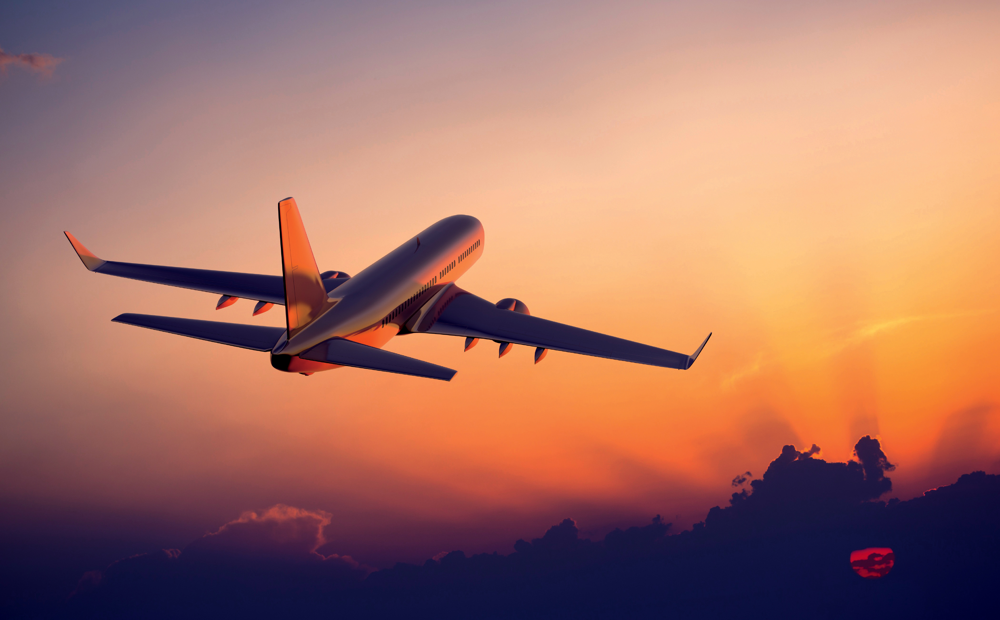

# Final-Proj_Flight-Delays

Team members: Nay, Tammy & Karen

**Who likes to travel?**

U.S. domestic travel increased 1.9 percent in 2017 to a total of 2.25 billion person-trips. Domestic leisure travel increased 2.1 percent in 2017 to nearly 1.8 billion person-trips. Leisure travel accounted for 80 percent of all U.S. domestic travel in 2017. In 2017, domestic travelers spent $880 billion in the United States—representing 85 percent of total travel expenditures. Out of this $880 billion, 20% was spent on public transportation & 17% on auto transportation.

**Goal**

For our project we wanted to look into flight history and analyze what factors cause the dealy. Then, we used this factors to predict if the flight will be cancelled or not.

**Data Source**

https://www.transtats.bts.gov/DL_SelectFields.asp?Table_ID=236

*Note: We had a trouble uploading the main data file so we took the screenshots of each page and uploaded them as references.
